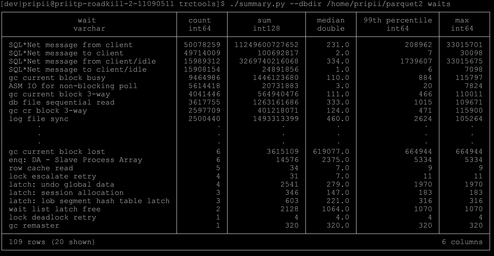

This repository contains scripts that process and analyze Oracle SQL trace output.

`trc2db` turns Oracle SQL trace (also known as event 10046) files into Parquet, or loads it into Oracle database.

`summary.py` contains pre-canned queries and statistics about the generated Parquet file(s).

# Installation

Scripts are tested with Python 3.11, but in principle it should work with older versions as well.

```
git clone https://github.com/priitp2/trctools.git
```

For trc2db.py
```
$ pip.3.11 install pyarrow oracledb
```
If you do not intend to use Oracle as a backend, then `oracledb` can be omitted.

For summary.py
```
$pip3.11 install pyarrow duckdb HdrHistogram
```

# Usage

```
./trc2db.py --dbdir /home/pripii/parquet trace0*/*
```
# summary.py

It contains some pre-canned examples of what can be done in Duckdb.

```
$ ./summary.py -h
usage: summary.py [-h] [--dbdir dbdir] {summary,histogram,outliers,waits,wait_histogram,db} ...

Generate summary from processed traces

options:
  -h, --help            show this help message and exit
  --dbdir dbdir         Directory for Parquet files

Available subcommands:
  {summary,histogram,outliers,waits,wait_histogram,db}
    summary             Generates summary of the executed sql_id's
    histogram           Generates histogram for the specified sql_id or wait event name.
    outliers            Prints out executions that took longer than --thresold microseconds
    waits               Shows wait events for the sql_id
    wait_histogram      Generates histogram for the wait event
    db                  Shows summary information about processed trace files

```

## Available subcommands:

### summary


### histogram

```
usage: summary.py histogram [-h] [--sql_id SQL_ID] [--wait_name WAIT_NAME] [--output FNAME]

options:
  -h, --help            show this help message and exit
  --sql_id SQL_ID       Comma separated list of sql_id's for which histogram, outliers or waits are produced
  --wait_name WAIT_NAME
                        Name of the wait event
  --output FNAME        Output filename
```

Either `--sql_id` or `--wait_name` is mandatory. Default filename is `histogram.out`. Output is in
[HdrHistogram](https://github.com/HdrHistogram/HdrHistogram) format, you can use
[HdrHistogram Plotter](http://hdrhistogram.github.io/HdrHistogram/plotFiles.html) to generate a nice percentile distribution graph.

#### Example

```
[dev|pripii@priitp-roadkill-2-11090511 trctools]$ ./summary.py --dbdir /home/pripii/parquet histogram --sql_id 7dh01v2jgss7c
```
This creates file `elapsed_7dh01v2jgss7c.out`. And as a plot (note the extreme otliers!): 

### outliers

```
[dev|pripii@priitp-roadkill-2-11090511 trctools]$ ./summary.py --dbdir /home/pripii/parquet outliers --help
usage: summary.py outliers [-h] [--sql_id SQL_ID] [--thresold THRESOLD]

options:
  -h, --help           show this help message and exit
  --sql_id SQL_ID      Comma separated list of sql_id's for which outliers are displayed
  --thresold THRESOLD  Outlier thresold in microseconds
```


### waits

´summary.py` discriminates between SQL*Net events that happen during the query processing and while waiting on the client to say something. Latter events have prefix '/idle'.

It shows waits either for the specific sql_id:


or for the whole trace:


# Data schema

trc2db tracks database client interactions with the database, and assigns `exec_id` to each interactions. `ops` is a type of
the database call, with some exceptions. Lines from the file header have a ops `HEADER`, and lines starting with `***` have ops
`STAR`. 

Some of the properties are renamed to something more human friendly, for example `e` to `elapsed_time`, but more esoteric
ones come as they are in the trace files.

### `event_name` and `event_raw`

In case of `WAIT`, `event_name` contains wait event name and `event_raw` unparsed text. In case of file headers, `event_name`
is the name of the header field and `event_raw` contains the value. Same goes with the lines starting with `***`. Timestamps
in those lines are persisted in `ts`.  

Alternative description of the schema is in `db/arrow.py`

|      name      |    type    |                                            logical_type                                             |
|----------------|------------|-----------------------------------------------------------------------------------------------------|
| schema         |            |                                                                                                     |
| exec_id        | INT64      |                                                                                                     |
| sql_id         | BYTE_ARRAY | StringType()                                                                                        |
| cursor_id      | BYTE_ARRAY | StringType()                                                                                        |
| ops            | BYTE_ARRAY | StringType()                                                                                        |
| cpu_time       | INT64      |                                                                                                     |
| elapsed_time   | INT64      |                                                                                                     |
| ph_reads       | INT64      |                                                                                                     |
| cr_reads       | INT64      |                                                                                                     |
| current_reads  | INT64      |                                                                                                     |
| cursor_missed  | INT64      |                                                                                                     |
| rows_processed | INT64      |                                                                                                     |
| rec_call_dp    | INT64      |                                                                                                     |
| opt_goal       | INT64      |                                                                                                     |
| plh            | INT64      |                                                                                                     |
| tim            | INT64      |                                                                                                     |
| c_type         | INT64      |                                                                                                     |
| event_name     | BYTE_ARRAY | StringType()                                                                                        |
| event_raw      | BYTE_ARRAY | StringType()                                                                                        |
| file_name      | BYTE_ARRAY | StringType()                                                                                        |
| line           | INT64      |                                                                                                     |
| ts             | INT64      | TimestampType(isAdjustedToUTC=0, unit=TimeUnit(MILLIS=<null>, MICROS=MicroSeconds(), NANOS=<null>)) |
| len            | INT64      |                                                                                                     |
| uid            | INT64      |                                                                                                     |
| oct            | INT64      |                                                                                                     |
| lid            | INT64      |                                                                                                     |
| hv             | INT64      |                                                                                                     |
| ad             | BYTE_ARRAY | StringType()                                                                                        |
| rlbk           | BYTE_ARRAY | StringType()                                                                                        |
| rd_only        | BYTE_ARRAY | StringType()                                                                                        |
| lobtype        | BYTE_ARRAY | StringType()                                                                                        |
| bytes          | INT64      |                                                                                                     |

